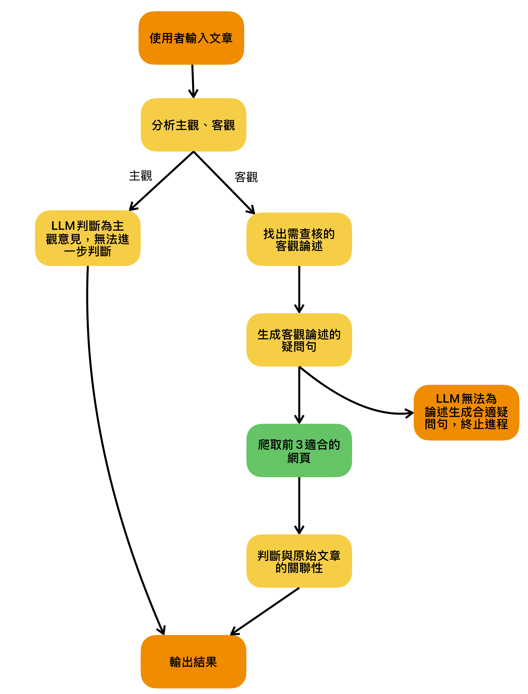

# Fact-checking AI Agent

這是一個基於 Streamlit 構建的自動化事實查核 Agent。整合了 Ollama (LLM) 進行語意分析與邏輯判斷，並串接 Tavily API 進行即時網路搜尋與證據檢索，旨在協助使用者快速驗證新聞或文章中的客觀陳述是否屬實。

---

## 專案特色
* **深度語意分析**：自動判斷文章是「主觀感受」還是「客觀陳述」。若是主觀內容（如心得感想），系統將自動略過不予查核。
* **論點擷取 (Claim Extraction)**：從長文中精準提取出具體、可驗證的事實陳述句。
* **智慧搜尋規劃**：LLM 化身 SEO 專家，將論點轉換為最適合搜尋引擎的關鍵字與問句。
* **本地快取機制 (Local Caching)**：內建 `Scraper` 模組，會將搜尋結果儲存於本地 (`data/evidence/`)，避免重複扣除 API 額度並加速回應。
* **AI 法官裁決**：綜合原始主張與搜尋到的證據，由 LLM 進行最終判決 (Correct/Incorrect/Unverifiable) 並給出理由。
* **互動式 UI**：使用 `Streamlit` 打造，具備即時進度顯示（包含趣味的「老師名言」載入畫面）。

---

## 運作流程 (Workflow)

1. **使用者輸入**：在網頁輸入一段文字或新聞內容。

2. **階段一**：分析 (Analysis)
    * LLM 判斷是否為主觀內容。
    * 若是客觀內容，擷取出一條條的「陳述句 (Claims)」。

3. **階段二**：檢索 (Retrieval)
    * LLM 針對每一條 Claim，產生疑問句。
    * 使用 Tavily 執行搜尋 (優先查本地快取，無快取才呼叫 Tavily)。

4. **階段三**：驗證 (Verification)
    * 將「陳述句 (Claims)」與「搜尋到的摘要證據」送回 LLM。
    * LLM 進行比對判決。

5. **報告生成**：UI 顯示綠色勾勾 (Correct) 或紅色叉叉 (Incorrect) 及證據來源連結。

* **完整流程**：



---

## 專案結構
```bash
TOC_final_project/
├── main.py                     # [程式入口] Streamlit 介面與主流程控制
├── agent_logic.py              # [中控邏輯] 串接 FactChecker 與 Scraper
├── API_KEY.py                  # [設定檔] 存放 API 金鑰 (需自行建立)
├── requirements.txt            # [依賴] 專案所需的 Python 套件
├── fact_checking/              # [核心模組] LLM 處理邏輯
│   ├── __init__.py
│   ├── FactChecker.py          # 負責分析文章、生成搜尋詞、驗證真偽
│   └── OllamaClient.py         # 負責與 Ollama API Gateway 通訊
├── scraper/                    # [爬蟲模組] 搜尋與檔案存取
│   ├── __init__.py
│   ├── EvidenceRetrieveHandler.py # 搜尋任務排程器
│   ├── EvidenceFileHandler.py     # 證據存檔與索引管理
│   ├── JsonFileHandler.py         # 底層 JSON 讀寫
│   └── Retriever.py               # Tavily API 封裝
├── data/                       # [資料儲存]
│   └── evidence/               # 存放搜尋回來的證據 JSON 檔
└── images/                     # [資源] UI 用頭像
    ├── user_icon.png
    ├── ai_icon.png
    └── user_icon1.png
```

---

## 環境建置與安裝
建議使用 Python 3.10 以上版本。請依照以下步驟設定開發環境：

### 1. 建立虛擬環境 (Virtual Environment)
在專案根目錄下執行以下指令，建立一個名為 .venv 的虛擬環境：
```Bash
# 使用 python 3.10
python -m venv .venv
```

### 2. 啟動虛擬環境
請根據您的作業系統選擇對應的指令：
#### Windows (CMD):
```Bash
.venv\Scripts\activate.bat
```

#### Windows (PowerShell / VS Code):
```Bash
.venv\Scripts\Activate.ps1
```

#### Mac / Linux:
```Bash
source .venv/bin/activate
```

### 3. 安裝依賴套件
當虛擬環境啟動後（終端機前方出現 `(.venv)` 字樣），請執行以下指令安裝所需套件：
```Bash
pip install -r requirements.txt
```

### 4. 設定 API 金鑰 (API_KEY.py)
請在專案根目錄下建立一個名為 API_KEY.py 的檔案，並填入您的金鑰資訊：
檔案內容範例：
```Python
# 用於存取 Ollama 服務的 API Key
OLLAMA_API_KEY = "your_ollama_api_key_here"

# 用於存取 Tavily 搜尋服務的 API Key
TAVILY_API_KEY = "your_tavily_api_key_here"
```
⚠️ 安全警告：請勿將您的 `API_KEY.py` 上傳至 GitHub 或公開分享，以免金鑰外洩。

### 5. 啟動應用程式
完成上述設定後，執行以下指令啟動 Streamlit 伺服器：
```Bash
streamlit run main.py
```
應用程式啟動後，瀏覽器應會自動開啟頁面。

---

<!-- 
## Development Workflow

### Adding New Modules
If you install any new package during development, please update the requirements file so others can sync:
```Bash
pip freeze > requirements.txt
```
Then commit and push the updated requirements.txt to the repository.
 -->
